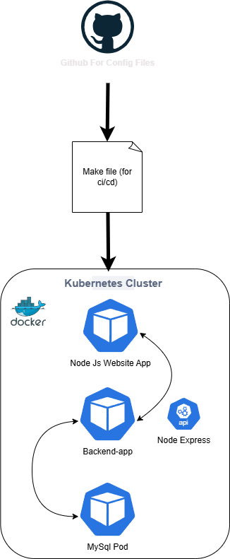

# container_observability
kubernetes project that integrates ci/cd pipeline via github actions, kubectl, docker, SQL, and open telemetry

**Documentation on steps to re-create**
1. install [chocolatey, kind ("choco install kind)(this will also install docker desktop)]
2. on command prompt create a kind cluster "kind create cluster --name my-cluster" then delete & recreate it in vscode
2. install docker & kind vscode extensions

